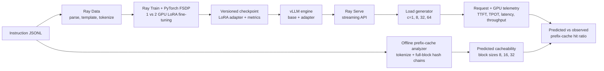

# Ray + vLLM Train-to-Serve Systems Lab

[](https://github.com/SarnadAbhilash/ray-vllm-systems-lab/actions/workflows/ci.yml)

[Watch the three-minute demonstration](demo/ray-vllm-systems-lab-demo.mp4).

Training and serving LLMs are usually demonstrated as separate notebooks, which hides the hard systems questions at their boundary: whether preprocessing feeds GPUs fast enough, whether distributed checkpoints actually recover, whether an adapter can move into a production engine, and whether agentic prompt structure makes KV-cache reuse predictable. This repository builds one measured lifecycle—from Ray Data through Ray Train/FSDP and LoRA checkpoints into vLLM on Ray Serve—then tests it under controlled load. Its original component is a no-GPU prefix-cache workload analyzer that estimates reusable full KV blocks from real JSONL conversations before an inference experiment spends GPU time.

> **Current milestone:** The measured train-to-serve lifecycle is complete. The repository includes
> the offline analyzer, Ray Data pipeline, 1/2-GPU LoRA training, FSDP checkpoints, interrupted-run
> recovery, vLLM/Ray Serve deployment, and the full 48-condition serving matrix.

## Architecture



## Results snapshot

### Serving

One Modal NVIDIA L4 served the base model and the Phase-2 LoRA adapter through the same vLLM engine.
The run covered prefix caching off/on, three prompt shapes, concurrency 1/8/32/64, and 1,920 measured
requests with no failures.

| Serving measurement | Result |
|---|---:|
| Conditions / requests | 48 / 1,920 |
| Maximum active streams | 64 |
| Prefix prediction mean / maximum error | 0.28 / 0.95 percentage points |
| Median cache-on TTFT change | -4.44% |
| Median cache-on output-throughput change | +2.51% |
| Peak GPU memory | 17.92 GiB |
| Cache-on cost range per million output tokens | $0.45–$29.04 |

At concurrency 64, prefix caching improved base long-prompt throughput by 17.8% and adapter
long-prompt throughput by 48.4%. Agentic prompts reached 94.59% full-block reuse but improved
throughput by only 5.7%–6.2%, showing why cacheability and end-to-end speedup must be measured
separately.


The complete per-condition table, interpretation, and integration failures are in
[docs/phase-3-report.md](docs/phase-3-report.md).

### Training

Phase 2 used the same pinned Qwen 0.5B model, Dolly split, global batch, and 12-step budget on Modal
NVIDIA L4 GPUs. This is one measured run per condition; it is a bottleneck probe, not a confidence
interval.

| Training measurement | 1 × L4 | 2 × L4 FSDP |
|---|---:|---:|
| Input tokens/second | 2,734.6 | 1,256.5 |
| Peak allocated memory/device | 3.557 GiB | 3.371 GiB |
| Mean GPU utilization, full fit | 6.2% | 14.6% |
| Speedup / scaling efficiency | 1.000× / — | 0.459× / 22.97% |

The controlled worker failure resumed from the step-6 checkpoint in **21.78 seconds**, including a
**2.52-second restore path**, and replayed two optimizer steps. Held-out perplexity improved from
**8.6308 to 7.5921** and teacher-forced token accuracy from **53.52% to 54.85%**.


The detailed interpretation, raw-artifact links, and failure analysis are in
[docs/phase-2-report.md](docs/phase-2-report.md). Phase 1's checked-in 10-request agentic sample
produced these offline upper-bound cache estimates:

| Measurement | 8-token blocks | 16-token blocks | 32-token blocks |
|---|---:|---:|---:|
| Prompt tokens | 809 | 809 | 809 |
| Full-block tokens | 776 | 720 | 640 |
| Reusable full-block tokens | 360 | 336 | 288 |
| Predicted hit ratio | 46.4% | 46.7% | 45.0% |


The full scorecard and measurement rules live in
[docs/benchmark-contract.md](docs/benchmark-contract.md).

## Reproduce Phase 1

Prerequisites: `uv`, Python 3.10+, and internet access for the tokenizer on the first run. Model
weights and a GPU are not required.

```bash
git clone https://github.com/SarnadAbhilash/ray-vllm-systems-lab.git
cd ray-vllm-systems-lab
make install
make verify
```

Run the analyzer on another plain-prompt, OpenAI chat, or OpenAI Batch-style JSONL file:

```bash
uv run prefix-cache-lab analyze requests.jsonl \
  --model Qwen/Qwen2.5-0.5B-Instruct \
  --block-sizes 8,16,32 \
  --output results/my-workload.json \
  --markdown results/my-workload.md
```

Compare a 16-token-block prediction with counters captured from a vLLM `/metrics` endpoint:

```bash
uv run prefix-cache-lab compare results/my-workload.json \
  --metrics http://localhost:8000/metrics \
  --block-size 16 \
  --output results/predicted-vs-observed.json
```

The analyzer intentionally does not import vLLM engine internals. It creates a parent-linked SHA-256
chain over complete token blocks and cache-partitioning metadata, models an initially empty cache in
JSONL arrival order, and assumes infinite capacity. That preserves the important identity and block
granularity semantics while keeping this a standalone prototype. Scheduler interleaving, eviction,
preemption, memory pressure, and KV offload can all lower the observed hit rate.

## Reproduce Phase 2

Prerequisites: a configured Modal account. The command creates one- and two-L4 functions, runs them
sequentially, and keeps checkpoints in named persistent Volumes:

```bash
uv sync --extra dev --extra charts --extra cloud
uv run modal run infra/modal_app.py \
  --experiment-id phase2-reproduction \
  --output results/phase2/raw/modal-results.json
uv run python scripts/plot_training.py results/phase2/raw/modal-results.json \
  --output-dir charts/phase2
```

The checked-in measurement is tied to implementation commit `c237d74`; hashes and adapter integrity
checks are in [results/phase2/provenance.json](results/phase2/provenance.json).

## Reproduce Phase 3

Prerequisites: a configured Modal account and the `ray-vllm-lab-artifacts` Volume produced by Phase
2. The command launches separate cache-off and cache-on L4 functions, then downloads the aggregate
and request-level manifests:

```bash
uv sync --extra dev --extra charts --extra cloud
uv run modal run infra/modal_serving.py \
  --experiment-id phase3-reproduction \
  --output results/phase3/raw/modal-results.json
uv run python scripts/summarize_serving.py results/phase3/raw/modal-results.json \
  --json results/phase3/summary.json \
  --csv results/phase3/conditions.csv
uv run python scripts/plot_serving.py results/phase3/raw/modal-results.json \
  --output-dir charts/phase3
```

The checked-in run is tied to implementation commit `cc28253`; source, artifact hashes, hardware,
software, and cost assumptions are in
[results/phase3/provenance.json](results/phase3/provenance.json).

## Lifecycle scorecard

| Capability | Evidence | Status |
|---|---|---|
| JSONL conversation parsing and exact chat-template tokenization | Analyzer CLI + sample corpus | **Complete** |
| Repeated-prefix discovery and block-size comparison | JSON/Markdown reports + charts | **Complete** |
| Prediction versus observed vLLM cached tokens | 24 paired cache-on conditions | **Complete** |
| Ray Data preprocessing | Revision-pinned distributed tokenization + raw stats | **Complete** |
| Ray Train + PyTorch FSDP LoRA | Measured 1/2-L4 runs + validated adapters | **Complete** |
| Interrupted-run recovery | Step-8 failure, step-6 restore, timed resume | **Complete** |
| vLLM + Ray Serve base/adapter serving | Streaming deployment + 1,920 requests | **Complete** |
| Prefix caching, concurrency, prompt-length matrix | Raw traces, summary, report, and charts | **Complete** |
| End-to-end operational walkthrough | Reproduction and validation sequence | **Complete** |
| vLLM upstream issue or PR | [APC observability documentation PR #53395](https://github.com/vllm-project/vllm/pull/53395) | **Complete** |

## Bottleneck investigation

The strongest training bottleneck is model scale: two-GPU FSDP is slower than one GPU for this 0.5B,
short-sequence workload. Collective and orchestration costs dominate the few seconds of training
compute, yielding 0.459× speedup. In serving, continuous batching is a larger capacity lever than
prefix caching: base output throughput rose from a 25.8 tokens/s median at concurrency 1 to 823.6 at
concurrency 64, while the median cache-on change across paired conditions was +2.51%. See
[docs/phase-2-report.md](docs/phase-2-report.md#bottleneck-investigation) and
[docs/phase-3-report.md](docs/phase-3-report.md#bottleneck-investigation).

## What failed and why

The most consequential training failure was a recovery run that produced an empty adapter because
FSDP state was filtered twice. The serving phase also exposed real dependency and warm-up boundaries:
vLLM 0.25.1 failed during an unrelated model's Triton warm-up path, the slim runtime lacked a system
CUDA toolkit for FlashInfer JIT, and Ray Serve's FastAPI ingress recursed under the resolved
Pydantic/FastAPI stack. The final path validates adapter tensors, pins vLLM 0.23.0, selects vLLM's
native sampler fallback, and uses Ray Serve's direct Starlette callable. See the detailed tables in
[docs/phase-2-report.md](docs/phase-2-report.md#what-failed-and-why) and
[docs/phase-3-report.md](docs/phase-3-report.md#what-failed-and-why).

## Design notes

- Target model: [`Qwen/Qwen2.5-0.5B-Instruct`](https://huggingface.co/Qwen/Qwen2.5-0.5B-Instruct), small enough for budget-conscious 1/2-GPU comparisons while retaining a real chat template and LoRA-serving path.
- The analyzer is inspired by, but independent from, the open [vLLM offline prefix-cache analyzer RFC](https://github.com/vllm-project/vllm/issues/47993). It neither copies an implementation nor claims compatibility with a future vLLM CLI.
- The serving harness records vLLM's per-request cached-token count and compares it with the analyzer's full-block-token denominator, so partial prompt tails are excluded on both sides.
- Ray Train recovery follows the current [Train V2 fault-tolerance pattern](https://docs.ray.io/en/latest/train/user-guides/fault-tolerance.html), using persistent checkpoints and a stable run name rather than deprecated `Trainer.restore` APIs.
- Training uses Modal single-node 1/2-GPU functions and persistent Volumes; serving reuses the validated adapter from the same artifact Volume. Modal's multi-GPU container behavior is documented in its [GPU guide](https://modal.com/docs/guide/gpu).

## Repository map

```text
src/ray_vllm_lab/analyzer/  standalone analyzer, report, and metrics comparison
src/ray_vllm_lab/training/  Ray Data, Ray Train V2, FSDP/LoRA, checkpoint recovery
src/ray_vllm_lab/serving/   Ray Serve deployment, vLLM engine, workloads, and client metrics
infra/                      Modal GPU functions and separate pinned training/serving environments
data/                       training, analyzer, and repeated-prefix serving workloads
results/                     raw manifests, provenance, summaries, and condition tables
charts/                      generated cache, training, and serving evidence
demo/                        narrated three-minute walkthrough
tests/                       deterministic unit tests (no network or GPU)
docs/                        benchmark contract, phase reports, walkthrough, upstream plan
```

## Roadmap

The phases, acceptance criteria, and artifact boundaries are in [docs/roadmap.md](docs/roadmap.md).
The measured lifecycle, demonstration, and upstream observability contribution are complete. The
standalone analyzer remains intentionally separate from vLLM while maintainers consider the related
RFC and measured validation.

## License

MIT
