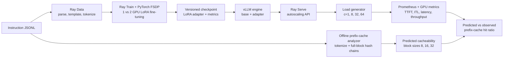
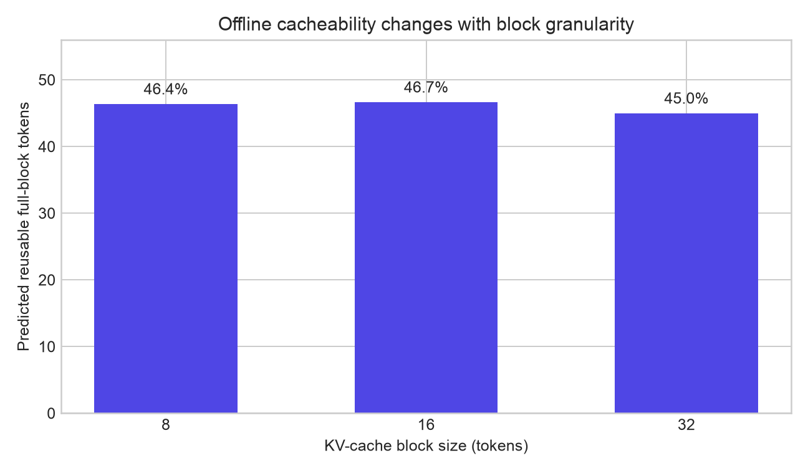
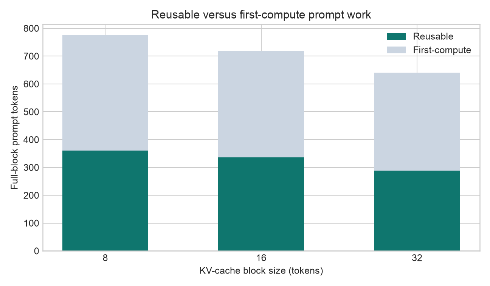

# Ray + vLLM Train-to-Serve Systems Lab

[](https://github.com/SarnadAbhilash/ray-vllm-systems-lab/actions/workflows/ci.yml)

Training and serving LLMs are usually demonstrated as separate notebooks, which hides the hard systems questions at their boundary: whether preprocessing feeds GPUs fast enough, whether distributed checkpoints actually recover, whether an adapter can move into a production engine, and whether agentic prompt structure makes KV-cache reuse predictable. This repository builds one measured lifecycle—from Ray Data through Ray Train/FSDP and LoRA checkpoints into vLLM on Ray Serve—then tests it under controlled load. Its original component is a no-GPU prefix-cache workload analyzer that estimates reusable full KV blocks from real JSONL conversations before an inference experiment spends GPU time.

> **Current milestone:** Phase 1 is complete: the offline analyzer, tests, sample workload,
> machine-readable report, charts, and runtime-metric comparison path are reproducible. GPU training,
> recovery, serving, and load-test measurements are deliberately marked pending rather than simulated.

## Architecture



## Results snapshot

Phase 1 values below come from the checked-in 10-request agentic sample using the exact
`Qwen/Qwen2.5-0.5B-Instruct` tokenizer. They are offline upper-bound estimates, not GPU-serving
measurements.

| Measurement | 8-token blocks | 16-token blocks | 32-token blocks |
|---|---:|---:|---:|
| Prompt tokens | 809 | 809 | 809 |
| Full-block tokens | 776 | 720 | 640 |
| Reusable full-block tokens | 360 | 336 | 288 |
| Predicted hit ratio | 46.4% | 46.7% | 45.0% |





The full train-to-serve scorecard and the rules for producing it live in
[docs/benchmark-contract.md](docs/benchmark-contract.md). No unmeasured GPU number is presented as
a result.

## Reproduce Phase 1

Prerequisites: `uv`, Python 3.10+, and internet access for the tokenizer on the first run. Model
weights and a GPU are not required.

```bash
git clone https://github.com/SarnadAbhilash/ray-vllm-systems-lab.git
cd ray-vllm-systems-lab
make install
make verify
```

Run the analyzer on another plain-prompt, OpenAI chat, or OpenAI Batch-style JSONL file:

```bash
uv run prefix-cache-lab analyze requests.jsonl \
  --model Qwen/Qwen2.5-0.5B-Instruct \
  --block-sizes 8,16,32 \
  --output results/my-workload.json \
  --markdown results/my-workload.md
```

Compare a 16-token-block prediction with counters captured from a vLLM `/metrics` endpoint:

```bash
uv run prefix-cache-lab compare results/my-workload.json \
  --metrics http://localhost:8000/metrics \
  --block-size 16 \
  --output results/predicted-vs-observed.json
```

The analyzer intentionally does not import vLLM engine internals. It creates a parent-linked SHA-256
chain over complete token blocks and cache-partitioning metadata, models an initially empty cache in
JSONL arrival order, and assumes infinite capacity. That preserves the important identity and block
granularity semantics while keeping this a standalone prototype. Scheduler interleaving, eviction,
preemption, memory pressure, and KV offload can all lower the observed hit rate.

## Lifecycle scorecard

| Capability | Evidence | Status |
|---|---|---|
| JSONL conversation parsing and exact chat-template tokenization | Analyzer CLI + sample corpus | **Complete** |
| Repeated-prefix discovery and block-size comparison | JSON/Markdown reports + charts | **Complete** |
| Prediction versus vLLM Prometheus counters | `compare` command | **Complete (GPU observation pending)** |
| Ray Data preprocessing | Distributed tokenization/materialization benchmark | Phase 2 |
| Ray Train + PyTorch FSDP LoRA | 1/2-GPU runs with checkpoint artifacts | Phase 2 |
| Interrupted-run recovery | Injected failure and timed resume | Phase 2 |
| vLLM + Ray Serve base/adapter serving | Deployment and smoke tests | Phase 3 |
| Prefix caching, concurrency, prompt-length matrix | Load-test report and raw request traces | Phase 3 |
| Three-minute demo video | Linked recording | Phase 4 |
| Ray/vLLM upstream issue or PR | Maintainer-reviewed contribution | Phase 4 |

## Bottleneck investigation

The phase-1 sample reveals a structural bottleneck before any GPU is allocated: reuse is limited by
full-block alignment. Shared system prompts may look identical yet lose their last partial block at
larger block sizes; adapter IDs and cache salts intentionally split otherwise identical prefixes into
separate cache namespaces. Phase 3 will test whether this static upper bound remains useful under a
finite vLLM cache and concurrent arrival patterns. See the evidence and next experiments in
[docs/phase-1-report.md](docs/phase-1-report.md#bottleneck-investigation).

## What failed and why

The first clean environment build failed because `pyproject.toml` referenced `README.md` before that
file had been added. This was a repository assembly error, not a dependency failure; adding the
readme before repeating the clean sync fixes it. The first real chat-template run then exposed a
missing direct Jinja dependency, which is now pinned and locked. More importantly, no FSDP, recovery,
vLLM, or GPU result is claimed yet: those experiments require controlled GPU runs and will be added
with raw artifacts in later phases. The running failure log is in
[docs/phase-1-report.md](docs/phase-1-report.md#what-failed-and-why).

## Design notes

- Target model: [`Qwen/Qwen2.5-0.5B-Instruct`](https://huggingface.co/Qwen/Qwen2.5-0.5B-Instruct), small enough for budget-conscious 1/2-GPU comparisons while retaining a real chat template and LoRA-serving path.
- The analyzer is inspired by, but independent from, the open [vLLM offline prefix-cache analyzer RFC](https://github.com/vllm-project/vllm/issues/47993). It neither copies an implementation nor claims compatibility with a future vLLM CLI.
- vLLM exposes token-counting counters for [`vllm:prefix_cache_queries` and `vllm:prefix_cache_hits`](https://docs.vllm.ai/en/latest/design/metrics/), which is why the comparison uses token hit ratio rather than request hit ratio.
- Ray Train recovery will follow the current [Train V2 fault-tolerance pattern](https://docs.ray.io/en/latest/train/user-guides/fault-tolerance.html), using persistent checkpoints and a stable run name rather than deprecated `Trainer.restore` APIs.
- GPU phases will use Modal single-node 1/2-GPU functions and a persistent Volume; Modal currently supports multiple GPUs per container as documented in its [GPU guide](https://modal.com/docs/guide/gpu).

## Repository map

```text
src/ray_vllm_lab/analyzer/  standalone analyzer, report, and metrics comparison
data/sample/                 agentic JSONL and synthetic Prometheus fixture
results/sample/              reproducible machine- and human-readable outputs
charts/                      generated Phase-1 evidence
tests/                       deterministic unit tests (no network or GPU)
docs/                        benchmark contract, phase report, demo, upstream plan
```

## Roadmap

The phases, acceptance criteria, and artifact boundaries are in [docs/roadmap.md](docs/roadmap.md).
The next phase is GPU training: Ray Data preprocessing, Ray Train/FSDP LoRA on one and two GPUs,
checkpoint restoration, injected-failure recovery, throughput/memory telemetry, and before/after
quality evaluation.

## License

MIT
