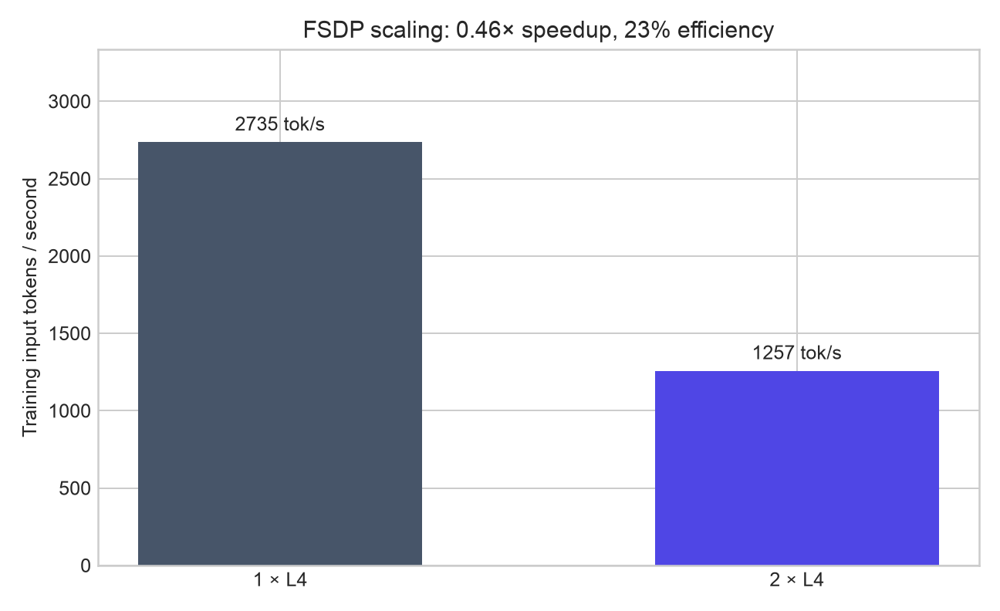
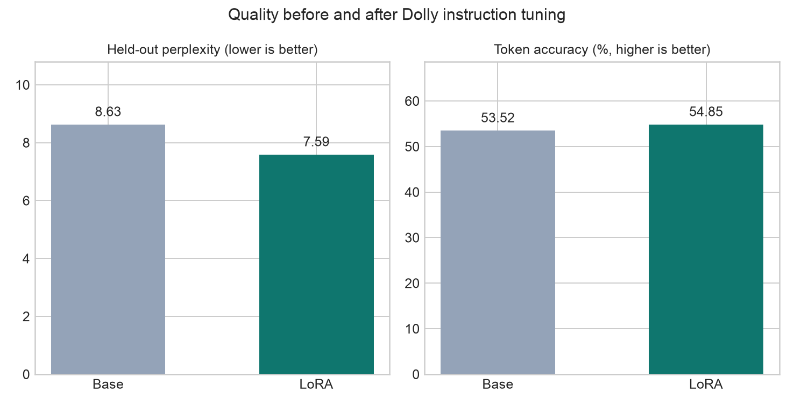

# Phase 2 report — Ray Data + Ray Train/FSDP LoRA

## Outcome

Phase 2 implements and measures the training half of the lifecycle. Ray Data loads a revision-pinned
Dolly split, applies the Qwen chat template in a two-actor tokenization pool, masks prompt tokens,
and materializes fixed-shape tensors. Ray Train V2 launches one worker per GPU. The two-GPU path
uses PyTorch FSDP with PEFT-aware auto-wrapping and `use_orig_params=True`; both paths train the same
rank-8 LoRA adapter at the same global batch size and optimizer-step budget.

Checkpoints contain adapter weights, optimizer state, and trainer state. A controlled probe writes a
durable checkpoint at step 6, fails both workers once after step 8, and lets Ray reconstruct the
two-worker group. The retry restores at step 6, replays two steps, and finishes at step 12. Final
adapter files were downloaded from the persistent Modal Volume and independently checked: every
condition contains 192 tensors in a 4,350,392-byte safetensors file.

## Reproduce

Install the local reporting and Modal dependencies:

```bash
uv sync --extra dev --extra charts --extra cloud
```

Run the complete matrix sequentially so GPU allocations do not overlap:

```bash
uv run modal run infra/modal_app.py \
  --experiment-id phase2-reproduction \
  --output results/phase2/raw/modal-results.json
```

Regenerate the charts strictly from the raw aggregate:

```bash
uv run python scripts/plot_training.py results/phase2/raw/modal-results.json \
  --output-dir charts/phase2
```

The Modal functions use named persistent Volumes for the Hugging Face cache and Ray checkpoints.
No cloud credential is committed to the repository.

## Results

| Measurement | 1 × NVIDIA L4 | 2 × NVIDIA L4, FSDP |
|---|---:|---:|
| Training input tokens/s | 2,734.6 | 1,256.5 |
| Speedup | 1.000× | 0.459× |
| Scaling efficiency | — | 22.97% |
| Peak allocated memory/device | 3.557 GiB | 3.371 GiB |
| Peak process memory/device | 4.615 GiB | 4.305 GiB |
| Mean utilization over full fit | 6.2% | 14.6% |
| Mean utilization while active | 26.8% | 43.6% |
| Ray Train fit wall time | 43.2 s | 61.6 s |

The utilization sampler queried every visible GPU with `nvidia-smi` every 250 ms over the whole
`trainer.fit()` call. “Active” excludes zero-utilization samples; both views are reported so startup,
evaluation, and checkpoint idle time is not hidden. Peak allocated memory comes from
`torch.cuda.max_memory_allocated()` and is reduced across ranks with a distributed maximum.

| Recovery measurement | Result |
|---|---:|
| Injected failure | After step 8 |
| Durable checkpoint | Step 6 |
| Restore path (model + adapter + optimizer) | 2.52 s |
| Failure to first recovered optimizer step | 21.78 s |
| Replayed optimizer steps | 2 |
| Final recovery-run perplexity | 7.5932 |

| Held-out quality | Base | LoRA | Change |
|---|---:|---:|---:|
| Cross-entropy loss | 2.1553 | 2.0271 | -5.95% |
| Perplexity | 8.6308 | 7.5921 | -12.03% |
| Teacher-forced next-token accuracy | 53.52% | 54.85% | +1.33 pp |

Quality is measured on the same frozen 32-example Dolly slice before and after training. It is a
lightweight smoke evaluation, not a claim of broad instruction-following improvement.





## Bottleneck investigation

The additional GPU made this workload slower. The 0.5B model, 192-token cap, global batch of 8, and
12-step budget leave very little matrix-multiplication work per collective. FSDP adds all-gather,
reduce-scatter, parameter-view, and process coordination overhead, while the one-GPU path avoids
those costs. The result is 0.459× speedup and only 22.97% scaling efficiency despite higher active
GPU utilization on two devices. FSDP saved just 0.186 GiB of peak allocated memory per device because
the base model already fits comfortably on one L4 and LoRA trains only a small parameter subset.

The end-to-end telemetry reveals a second bottleneck: GPUs are idle for much of `trainer.fit()`.
Whole-fit mean utilization was 6.2% for one GPU and 14.6% across two GPUs, versus 26.8% and 43.6%
when nonzero. Model construction, initial/final evaluation, Ray worker setup, and full-state
checkpoint gathering dominate a run whose measured training compute lasts only 3.91 or 8.65
seconds. Ray Data preprocessing also spends roughly 26 seconds materializing only 160 rows; actor and
tokenizer startup, not tokenization work, dominates. A larger model, longer sequences, larger global
batch, persistent preprocessing actors, and a longer steady-state window are the next scaling tests.

## What failed and why

| Failure | Root cause | Resolution |
|---|---|---|
| Ray Train stopped before launching workers | The first implementation passed the removed Train V1 `metadata` argument to the V2 trainer | Removed the obsolete argument and kept the V2 migration mode explicit |
| A successful remote run failed while returning its manifest | `torch.__version__` is a `TorchVersion` subclass, which Modal could not deserialize | Converted library versions to plain strings and forced a JSON-safe result boundary |
| Two-GPU FSDP rejected the model at initialization | Frozen base parameters were BF16 while trainable LoRA parameters were FP32 inside the same flat parameter | Added PEFT's FSDP auto-wrap policy so trainable adapter modules are wrapped safely |
| FSDP asserted that a post-backward tensor had no `grad_fn` | The pre-training evaluation used `torch.inference_mode()`, and FSDP lazily created parameter views as inference tensors | Switched evaluation to `torch.no_grad()`, preserving later autograd behavior |
| The first recovery probe appeared to work but warned that every adapter key was missing | The checkpoint path filtered the FSDP state through PEFT twice, producing a valid but empty safetensors file | Passed the full FSDP state directly to `save_pretrained`, then verified 192 tensors in every final adapter |
| Two GPUs were much slower than one | Communication and orchestration dominated the tiny model and short run | Kept the negative result, instrumented it, and made workload size the next scaling hypothesis |

The empty-adapter incident is the most important failure in this phase: control-plane success and a
finished Ray result did not prove checkpoint correctness. Treating warnings as evidence and checking
the serialized tensor inventory prevented a false recovery claim.

## Evidence and limitations

- Benchmark implementation commit: `c237d7446be8e98fbf95c8b6590ef13039077cb5`.
- Exact model and dataset revisions, raw samples, run timestamps, and dependency versions are in
  [`results/phase2/provenance.json`](../results/phase2/provenance.json) and the three raw manifests.
- This phase reports one measured run per condition because of GPU budget. The comparison is useful
  for bottleneck discovery, but it does not include variance or confidence intervals.
- Throughput measures non-padding input tokens and excludes two warm-up optimizer steps. It is not an
  end-to-end job throughput number.
- Quality is teacher-forced loss/perplexity/token accuracy. Generation-based instruction evaluation
  is deferred to the inference phase, where base and adapter share one deterministic serving harness.

## Next decision gate

Phase 3 is accepted only when Ray Serve fronts vLLM for both base and LoRA requests, the load harness
records TTFT/TPOT/tail latency/token throughput across the declared concurrency and prompt matrix,
and observed prefix-cache counters are compared with the Phase-1 prediction.
