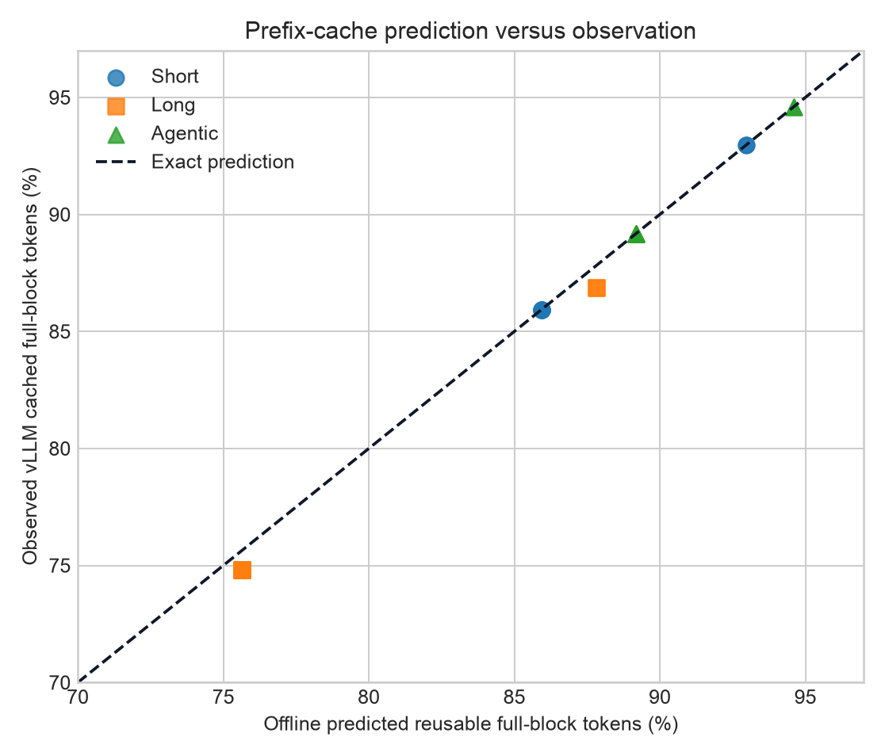
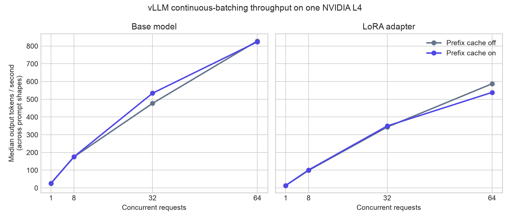
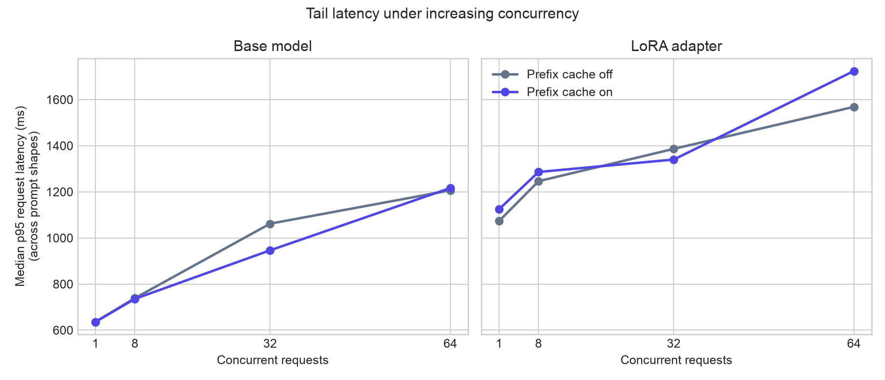

# Phase 3 report — vLLM on Ray Serve

## Outcome

Phase 3 serves the revision-pinned Qwen base model and the validated rank-8 LoRA adapter from one
vLLM `AsyncLLM` engine inside a one-GPU Ray Serve replica. A streaming HTTP client measures time to
first token (TTFT), time per output token (TPOT), p50/p95/p99 request latency, input/output token
throughput, cache reuse, GPU utilization, peak memory, and estimated resource cost. The complete
matrix covers base and adapter targets, short/long/agentic prompts, concurrency 1/8/32/64, and prefix
caching off/on in separate GPU functions.

The run completed 1,920 measured requests with no failures. Ray Serve observed 64 simultaneous
active streams, confirming that vLLM was scheduling continuously batched work through one engine.
The standalone analyzer predicted the observed full-block cache ratio with 0.28 percentage points
mean absolute error and 0.95 points maximum error across 24 cache-on conditions.

## Reproduce

Install local reporting and Modal dependencies:

```bash
uv sync --extra dev --extra charts --extra cloud
```

The serving image is separate from the training image because vLLM controls its own Torch and
Transformers compatibility set. Run cache-off and cache-on functions sequentially:

```bash
uv run modal run infra/modal_serving.py \
  --experiment-id phase3-reproduction \
  --output results/phase3/raw/modal-results.json
```

Regenerate the tabular summary and charts from the raw aggregate:

```bash
uv run python scripts/summarize_serving.py results/phase3/raw/modal-results.json \
  --json results/phase3/summary.json \
  --csv results/phase3/conditions.csv
uv run python scripts/plot_serving.py results/phase3/raw/modal-results.json \
  --output-dir charts/phase3
```

The request-level manifests are retained in `results/phase3/raw/manifests/`. SHA-256 hashes and the
exact source commit, model revision, hardware, software, and cost assumptions are in
[`results/phase3/provenance.json`](../results/phase3/provenance.json).

## Measurement contract

| Setting | Value |
|---|---|
| Hardware | 1 × NVIDIA L4, 23,034 MiB reported |
| Runtime | Ray 2.57.0, vLLM 0.23.0, Torch 2.11.0+cu130 |
| Model | Qwen2.5-0.5B-Instruct, BF16, pinned revision |
| Adapter | Phase-2 two-GPU FSDP LoRA, rank 8 |
| Engine | 1,024-token context, 16-token KV blocks, eager execution |
| Generation | Temperature 0, 8–16 output tokens |
| Prompts | Short 34–37, long 554–566, agentic 75–90 input tokens |
| Load | Concurrency 1/8/32/64; 32 requests, or 64 requests at concurrency 64 |
| Isolation | New engine per cache mode; cache reset before every condition |

Each target receives two warm-up requests before telemetry starts. Client timing begins immediately
before the HTTP request and therefore includes Ray Serve routing and serialization. TTFT ends at the
first streamed token event. TPOT is `(request latency - TTFT) / (output tokens - 1)`; it is an
average post-first-token interval, not a percentile over every token gap. Costs use the requested
L4 + 8 CPU + 32 GiB resource rate of $1.4344/hour and are estimates rather than invoice data.

## Results

| Run-level measurement | Prefix cache off | Prefix cache on |
|---|---:|---:|
| Measured conditions | 24 | 24 |
| Measured requests | 960 | 960 |
| Failed requests | 0 | 0 |
| Engine startup | 104.71 s | 103.55 s |
| Load-test wall time | 209.61 s | 205.47 s |
| Maximum active requests | 64 | 64 |
| Peak GPU memory | 17.920 GiB | 17.918 GiB |
| Mean GPU utilization during matrix | 11.76% | 10.77% |
| Observed cached/full-block tokens | 0% | 74.82%–94.59% |

The high memory watermark is intentional: vLLM reserves up to 80% of device memory for weights and
KV blocks. It does not imply the 0.5B model needs 17.9 GiB of weights.

### Offline prediction versus vLLM observation

The workload is replayed in a deterministic order from an empty cache. Concurrency 1/8/32 uses 32
requests; concurrency 64 uses 64. Ratios are identical for base and adapter because each condition
is reset and evaluated within one cache namespace.

| Prompt shape | Requests | Predicted | Observed | Absolute error |
|---|---:|---:|---:|---:|
| Short | 32 | 85.94% | 85.94% | 0.00 pp |
| Long | 32 | 75.63% | 74.82% | 0.82 pp |
| Agentic | 32 | 89.19% | 89.19% | 0.00 pp |
| Short | 64 | 92.97% | 92.97% | 0.00 pp |
| Long | 64 | 87.82% | 86.87% | 0.95 pp |
| Agentic | 64 | 94.59% | 94.59% | 0.00 pp |



The exact matches show that a no-GPU block model can answer the capacity-planning question for a
small, no-eviction workload. The long-prompt gap is also useful: vLLM admitted slightly fewer
reusable blocks than the infinite-cache arrival-order model predicted, even though capacity was
ample. The analyzer deliberately treats scheduling and block admission as engine behavior to
measure, not behavior to duplicate from vLLM internals.

### Latency and throughput at concurrency 32, cache on

| Target/workload | TTFT p50 | TPOT p50 | Latency p50 / p95 / p99 | Input tok/s | Output tok/s | $/M output tok |
|---|---:|---:|---:|---:|---:|---:|
| Base / short | 297.8 ms | 51.0 ms | 1,050 / 1,094 / 1,095 ms | 1,046.7 | 463.6 | $0.86 |
| Base / long | 273.7 ms | 41.1 ms | 910 / 946 / 948 ms | 18,615.2 | 534.0 | $0.75 |
| Base / agentic | 238.9 ms | 38.8 ms | 838 / 870 / 872 ms | 2,983.6 | 582.2 | $0.68 |
| Adapter / short | 325.8 ms | 68.6 ms | 1,362 / 1,408 / 1,409 ms | 813.8 | 349.2 | $1.14 |
| Adapter / long | 333.2 ms | 65.6 ms | 1,198 / 1,322 / 1,323 ms | 13,379.4 | 349.3 | $1.14 |
| Adapter / agentic | 321.8 ms | 67.0 ms | 1,311 / 1,340 / 1,341 ms | 1,945.3 | 358.8 | $1.11 |

The full 24-pair table, including both cache modes, every percentile, GPU windows, and costs, is in
[`results/phase3/conditions.csv`](../results/phase3/conditions.csv).

### Cache effect at concurrency 64

| Target/workload | TTFT off → on | p95 latency off → on | Output tok/s off → on | Throughput change |
|---|---:|---:|---:|---:|
| Base / short | 433.7 → 450.8 ms | 1,204 → 1,216 ms | 837.3 → 823.6 | -1.6% |
| Base / long | 574.3 → 442.5 ms | 1,525 → 1,295 ms | 662.1 → 779.7 | +17.8% |
| Base / agentic | 462.2 → 426.3 ms | 1,206 → 1,143 ms | 828.9 → 880.4 | +6.2% |
| Adapter / short | 490.2 → 1,742.2 ms | 1,556 → 2,804 ms | 629.8 → 351.2 | -44.2% |
| Adapter / long | 895.7 → 504.9 ms | 2,319 → 1,724 ms | 362.9 → 538.5 | +48.4% |
| Adapter / agentic | 503.0 → 457.4 ms | 1,569 → 1,481 ms | 587.2 → 620.6 | +5.7% |

Across all 24 pairs, prefix caching changed median p50 TTFT by -4.44% and median output throughput by
+2.51%. The steady-state cost estimate ranged from $0.45 to $29.04 per million output tokens; low
concurrency is expensive because a small engine processes few output tokens while the entire GPU is
reserved. The estimated total requested-resource cost for both complete functions, including
startup and warm-up, was $0.26.





## Bottleneck investigation

Continuous batching, not prefix caching, is the dominant capacity lever for this 0.5B model. Median
base output throughput across prompt shapes rose from 25.8 tokens/s at concurrency 1 to 823.6 at
concurrency 64. Adapter throughput rose from 13.8 to 538.5 tokens/s. The LoRA path is roughly half
the base throughput at concurrency 1 because adapter kernels add work to every decode step; batching
amortizes scheduling overhead, but the median adapter still trails the base at concurrency 64.

Prefix caching helps most when prefill is a material fraction of work. At concurrency 64, the
long-prompt workload gained 17.8% base throughput and 48.4% adapter throughput. Agentic traffic,
despite 94.59% observed full-block reuse, gained only 6.2% and 5.7% because prompts are 75–90 tokens
and every request still performs 8–16 decode steps. A high cache-hit ratio is therefore not itself a
throughput prediction; reusable token volume, prefill cost, decode length, adapter work, and
scheduler state all matter.

The adapter-short results are noisy and contradict the otherwise stable trend: cache-on concurrency
64 regressed 44.2%, while cache-off concurrency 8 also showed a large TTFT spike. vLLM logs reported
lazy Triton compilation for LoRA shrink/expand kernels during warm-up, and the experiment warms each
target at concurrency 1 rather than every shape/concurrency combination. With one replication per
condition, these points are evidence of shape-specific cold-path variance, not evidence that prefix
caching intrinsically harms short LoRA requests. A follow-up should repeat randomized condition
orders and report confidence intervals.

GPU utilization averaged only 10.8%–11.8% over the whole matrix even though 64 concurrent requests
were accepted. Cache resets, HTTP coordination, concurrency-1 baselines, and the very small model
leave the L4 underused. This is consistent with the Phase-2 result: the chosen model makes orchestration
and scheduling visible, but it is too small to represent a compute-saturated production model.

## What failed and why

| Failure | Root cause | Resolution |
|---|---|---|
| Serving image dependency resolution failed | vLLM 0.25.1 requires Transformers 5.5.3+, while the training runtime is pinned to 4.57.6 | Split training and serving dependency files instead of forcing one incompatible environment |
| Workload tokenization failed under Transformers 5 | `apply_chat_template(..., tokenize=True)` returned a mapping containing `input_ids`, not a bare list | Normalized both mapping and list return shapes and added a regression test |
| Ray Serve ingress recursed while deserializing the app | Ray 2.57's FastAPI ingress met the newer Pydantic/FastAPI stack installed by vLLM | Used Ray Serve's direct Starlette request callable, avoiding unnecessary FastAPI serialization |
| vLLM 0.25.1 crashed while starting Qwen on L4 | A released unconditional MiniMax M3 warm-up import triggers a Triton parser failure for unrelated models ([upstream issue #49920](https://github.com/vllm-project/vllm/issues/49920)) | Pinned the last validated API-compatible release, vLLM 0.23.0 |
| vLLM 0.23.0 tried to JIT-build a FlashInfer sampler without a system CUDA toolkit | The slim image has the CUDA runtime wheels but no `/usr/local/cuda` or `nvcc` | Set vLLM's supported `VLLM_USE_FLASHINFER_SAMPLER=0` native sampler fallback |

These failures are retained because they define the actual compatibility boundary. In particular,
successful model loading did not prove the engine was ready: both vLLM failures happened after
weights loaded, during profiling or kernel warm-up.

## Evidence and limitations

- Benchmark implementation commit: `cc2825309c79a8e65e52eebcdd22b0672b3c262f`.
- Raw request timings, token counts, cached tokens, telemetry samples, and run timestamps are in the
  two manifests. The compact aggregate and derived CSV are checked independently with hashes.
- This is one measured run per condition. It is a systems bottleneck probe, not a confidence
  interval or service-level objective.
- The workload fits in a 1.43-million-token KV cache, so it validates prediction without testing
  eviction, preemption, offload, or capacity pressure.
- Prefix-cache ratios use cached tokens divided by complete 16-token prompt blocks. Partial tails are
  excluded consistently from prediction and observation.
- TPOT is a request-level average after the first token. Per-token inter-arrival percentiles would
  require recording every streamed callback timestamp.
- Cost estimates use requested resource rates, exclude network/storage charges, and should not be
  treated as a cloud invoice.

The analyzer remains independent of vLLM implementation code. It references the open
[offline prefix-cache analyzer RFC](https://github.com/vllm-project/vllm/issues/47993) as related
discussion, does not copy or claim the proposal, and should not be proposed upstream without first
coordinating with maintainers.
